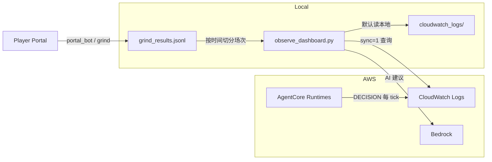

# Observability & Analytics — 部署指南

本指南面向 **已部署 AgentCore 队伍** 的用户，说明如何在本机运行观测台、分析比赛、批量约赛，以及需要配置哪些环境变量。

> 若尚未部署 agent，请先阅读仓库根目录 [README.md](../README.md) 第 1–5 节（Python / AWS / AgentCore 部署）。

---

## 这套工具做什么

| 组件 | 入口 | 作用 |
|------|------|------|
| **观测台** | `observe_dashboard.py` → `/` | 实时 CloudWatch DECISION 日志：延迟、指令、射门纪律、训练场对比 |
| **比赛分析** | `/analytics` | 按场次查看比分/控球/进球时间线、球员热力图、Bedrock AI 调参建议 |
| **设置** | `/settings` | 保存 AWS 凭证、从 CloudWatch 下载并缓存 DECISION 日志 |
| **CLI 报告** | `analyze_match.py` | 终端版逐 agent 统计 |
| **批量约赛** | `grind_matches.py` | 连续打 N 场练习赛，结果写入 `grind_results.jsonl` |
| **门户自动化** | `portal_bot.py` | Playwright 驱动 [Player Portal](https://agentic-football.aws.dev/) |
| **自动迭代** | `autopilot.py` | 约赛 → 拉日志 → 调参 → 重部署（见 README） |

### 架构（数据流）



---

## 1. 安装依赖

在 `agentic-football-sample-agents` 目录下：

```powershell
python -m venv .venv
.\.venv\Scripts\Activate.ps1          # Windows
# source .venv/bin/activate             # macOS / Linux

pip install -r requirements-observability.txt
python -m playwright install chromium   # 仅 portal_bot / grind_matches 需要
```

macOS / Linux 将 `.\.venv\Scripts\python.exe` 换成 `python` 即可。

---

## 2. 配置环境（勿提交密钥）

```powershell
copy .env.example .env
# 编辑 .env，填入 Workshop STS 凭证与队伍码
```

| 变量 | 必需 | 说明 |
|------|------|------|
| `AWS_DEFAULT_REGION` | 是 | 固定 `us-east-1` |
| `AWS_ACCESS_KEY_ID` | 是* | Workshop `ASIA…` 临时 key |
| `AWS_SECRET_ACCESS_KEY` | 是* | |
| `AWS_SESSION_TOKEN` | 是* | STS 临时 token |
| `AAFC_TEAM_CODE` | 约赛时需要 | Player Portal 队伍码（不含 `team:` 前缀） |

\* 也可在观测台 **Settings** 页写入 `~/.aws/credentials`，或只用 `aws configure`。

**切勿**将 `.env`、`.portal-profile/`、`cloudwatch_logs/`、`grind_results.jsonl` 提交到 Git（已在 `.gitignore`）。

---

## 3. 部署 agent 并确认日志前缀

1. 按 README 部署你的队伍（推荐 WSL：`bash deploy-wsl.sh ai-team-strands-extremely-aggressive`）。
2. 记下 runtime 名称前缀，例如 `agg_`（对应 log group `/aws/bedrock-agentcore/runtimes/agg_*`）。
3. 在 Portal 打一场练习赛，确认 CloudWatch 有 DECISION 行。

验证：

```powershell
$env:AWS_DEFAULT_REGION = "us-east-1"
.\.venv\Scripts\python.exe analyze_match.py --prefix agg_ --minutes 30
```

---

## 4. 启动观测台

```powershell
$env:AWS_DEFAULT_REGION = "us-east-1"
.\.venv\Scripts\python.exe observe_dashboard.py --prefix agg_ --minutes 180 --port 8777
```

| URL | 功能 |
|-----|------|
| http://localhost:8777/ | 观测台（实战 / 训练场 / 对比） |
| http://localhost:8777/analytics | 比赛分析 |
| http://localhost:8777/settings | AWS 凭证 & CloudWatch 下载 |

### 参数

| 参数 | 默认 | 说明 |
|------|------|------|
| `--prefix` | `agg_` | CloudWatch log group 前缀 |
| `--minutes` | `60` | 默认时间窗口 |
| `--port` | `8777` | 监听端口 |
| `--region` | `us-east-1` | AWS 区域 |

### 数据加载策略

- **首次打开 / 切换场次**：优先读本地 `cloudwatch_logs/`（秒开）。
- **Refresh data**：带 `sync=1`，从 CloudWatch 拉最新并合并到本地。
- **Settings → 下载 CloudWatch 数据**：主动拉取并下载 JSONL 备份。

### 比赛场次识别

Analytics 下拉框中的场次来自：

1. CloudWatch DECISION 按 `grind_results.jsonl` 时间窗切分（比分与 Portal 一致）；
2. 仅有 Portal 比分、尚无 CloudWatch 的场次会标 **「无 CloudWatch 日志」**。

---

## 5. 批量约赛（可选）

```powershell
# 一次性：固定队伍码
$env:AAFC_TEAM_CODE = "YOUR_CODE"
python portal_bot.py setup --team-code YOUR_CODE

# 连续 10 场 vs Total Attack United
.\.venv\Scripts\python.exe grind_matches.py --count 10 --bot aggressive --no-live-coach
```

结果追加到 `grind_results.jsonl`（本地、已 gitignore）。打完可在 Settings 下载 CloudWatch 数据，再在 Analytics 里按场分析。

---

## 6. 页面说明（截图）

截图见 [`screenshot/`](../screenshot/)（中/英各一套）。

| 截图 | 说明 |
|------|------|
| `observability_live.png` | 实战 DECISION：延迟、射门、指令 |
| `observability_training.png` | 训练场 JSONL |
| `observability_livevstraining.png` | 实战 vs 训练对比 |
| `select_match.png` | Analytics 场次选择与比赛数据 |
| `player-heatmap.png` | 球场热力图（按 role 上色） |
| `AI_advise.png` | Bedrock AI 调参建议 |
| `settings_*.png` | AWS 凭证与 CloudWatch 下载 |
| `ingame_*.png` / `match_result_*.png` | Portal 比赛与结果 |

右上角 **EN / 中文** 切换界面语言。

---

## 7. AI 调参建议（Bedrock）

Analytics 页选择模型后点击 **AI tuning advice**。需要：

- 账号已开通对应 Bedrock 模型（推荐 Nova 2 Lite；Claude 需美国出口/VPN 分流 Bedrock 域名）。
- 有效 AWS 凭证。

Claude 模型若遇 geo 限制，在 VPN 中将以下域名走美国节点：

- `bedrock-runtime.us-east-1.amazonaws.com`
- `bedrock.us-east-1.amazonaws.com`

---

## 8. 文件与目录

```
agentic-football-sample-agents/
├── observe_dashboard.py      # HTTP 服务入口
├── observe_main_page.py      # 观测台 UI
├── observe_analytics.py        # Analytics UI
├── observe_settings.py         # Settings UI
├── observe_i18n.py             # 中英双语
├── analyze_match.py            # CLI 日志分析
├── grind_matches.py            # 批量约赛
├── portal_bot.py               # Portal Playwright 驱动
├── lib/
│   ├── match_analytics.py      # 热力图、场次目录、AI 建议
│   ├── cloudwatch_store.py     # 本地 JSONL 缓存
│   ├── aws_credentials.py      # ~/.aws/credentials 读写
│   ├── aws_clients.py          # boto3 客户端
│   └── field_coords.py         # 5v5 球场坐标映射
├── cloudwatch_logs/            # 本地 DECISION 缓存（gitignore）
├── grind_results.jsonl         # Portal 比分记录（gitignore）
├── training_logs/              # training_ground 输出（gitignore）
├── .env.example                # 环境变量模板
└── requirements-observability.txt
```

---

## 9. 常见问题

### 页面一直「Querying CloudWatch…」

CloudWatch Logs Insights 较慢（1–3 分钟）。先用 Settings 下载数据，或依赖本地缓存；只有点 **Refresh data** 才同步云端。

### Analytics 只有一个合并场次 / 比分不对

旧数据可能未按场切分。确保有 `grind_results.jsonl`，Refresh 后应出现多场独立条目。

### `AWS 凭证过期`

Workshop STS 凭证几小时失效。Settings 重新保存，或更新 `.env` / `aws configure`。

### `No module named 'playwright'`

```powershell
pip install playwright
python -m playwright install chromium
```

### 热力图空白

选择具体场次（非「全部场次」），且该场需有 CloudWatch DECISION 行（含 `mx`/`my`）。

---

## 10. 快速命令备忘

```powershell
# 观测台
$env:AWS_DEFAULT_REGION = "us-east-1"
.\.venv\Scripts\python.exe observe_dashboard.py --prefix agg_ --minutes 180 --port 8777

# CLI 报告
.\.venv\Scripts\python.exe analyze_match.py --prefix agg_ --minutes 180

# 训练场（无需 AWS）
.\.venv\Scripts\python.exe training_ground.py

# 10 场 grind
.\.venv\Scripts\python.exe grind_matches.py --count 10 --bot aggressive
```

---

## English summary

1. `pip install -r requirements-observability.txt`
2. Copy `.env.example` → `.env`, fill AWS + `AAFC_TEAM_CODE`
3. Deploy agents; note log `--prefix` (e.g. `agg_`)
4. `python observe_dashboard.py --prefix agg_ --minutes 180 --port 8777`
5. Open `/analytics`, download logs from `/settings` if needed, use **Refresh data** to sync CloudWatch

Local cache lives in `cloudwatch_logs/`; match list is split using `grind_results.jsonl` time windows.
